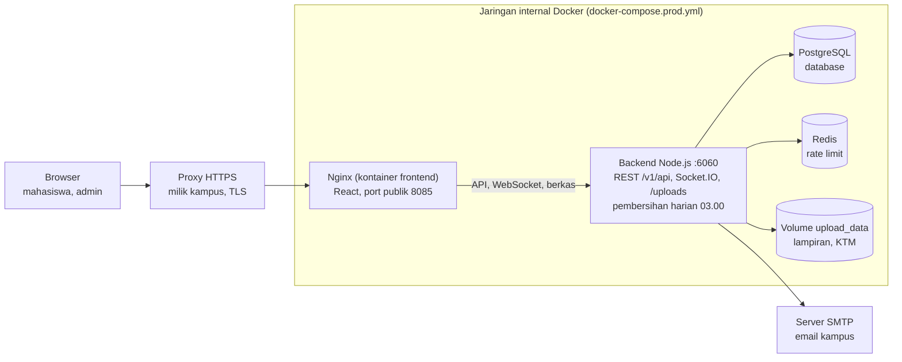

# Dokumentasi Serah Terima — Website Pengaduan Kemahasiswaan

*Per 8 Oktober 2026 · Disusun oleh Muhammad Farhan Al Hasan*

## 1. Ringkasan Proyek

Sistem Pelaporan dan Pengaduan Kemahasiswaan Universitas Bung Hatta (UBH) adalah aplikasi web tempat mahasiswa menyampaikan pengaduan akademik maupun non-akademik, lalu memantau penanganannya sampai selesai. Dokumen ini menyerahterimakan kode sumber, konfigurasi, dan pengetahuan operasional sistem kepada pihak kampus.

Sistem dikembangkan sebagai Computing Project Kelompok 3. Seluruh kode ada di branch `main` repositori GitHub `farhanlhsn/WebsitePengaduanKemahasiswaan`.

| Peran | Ruang lingkup |
| --- | --- |
| Mahasiswa | Mendaftar dengan KTM, mengajukan pengaduan (boleh anonim), memantau status, berdiskusi dengan admin lewat chat |
| Admin | Menangani pengaduan pada kategori yang ditugaskan kepadanya, memverifikasi akun mahasiswa, melihat analitik |
| SuperAdmin | Akses penuh: mengelola admin, kategori, penugasan kategori, audit log, dan keamanan sistem |

### Dokumen yang diserahkan

| Dokumen | Pembaca | Lokasi |
| --- | --- | --- |
| Dokumen serah terima (ini) | Pihak kampus, tim TI | `docs/SerahTerima.md` |
| User Manual (dengan screenshot) | Mahasiswa, admin, superadmin | [`docs/UserManual.md`](UserManual.md) |
| Referensi API (OpenAPI, 85 endpoint) dan event Socket.IO | Developer | [`docs/api/`](api/README.md); Swagger UI di `/api/docs` |
| Panduan Developer | Developer | [`docs/DeveloperGuide.md`](DeveloperGuide.md) |
| Production Runbook | Tim TI | [`docs/ProductionRunbook.md`](ProductionRunbook.md) |
| User Acceptance Test | Tim proyek, kampus | [`docs/UserAcceptanceTest.md`](UserAcceptanceTest.md) |
| Riwayat perubahan | Developer, tim TI | [`CHANGELOG.md`](../CHANGELOG.md) |
| Daftar revisi SRS dan SDD | Tim proyek | [`docs/RevisiSRS-SDD.md`](RevisiSRS-SDD.md) |
| Proposal, SRS, SDD, laporan akhir | Semua | `docs/*.pdf` |

## 2. Fitur dan Alur Pengaduan

Setiap pengaduan bergerak melalui enam status yang dijaga oleh satu state machine di server (`backend/src/utils/reportTransitions.js`), sehingga status tidak bisa melompat sembarangan.

### Fitur mahasiswa

- **Registrasi dan login**: daftar dengan NIM, email, dan foto KTM. Akun baru harus diverifikasi admin sebelum bisa login dan mengajukan laporan.
- **Pengajuan laporan**: judul, deskripsi, kategori, lampiran (maks. 5 MB/berkas), dan opsi anonim untuk kategori yang mengizinkannya. Setiap laporan mendapat nomor registrasi unik dan masih bisa diedit selama berstatus `PENDING`.
- **Dasbor dan pelacakan status**: daftar laporan milik sendiri beserta status terkini, serta alasan penolakan/pembatalan bila ada.
- **Chat per laporan**: diskusi real-time dengan admin (indikator mengetik, tanda dibaca per pengguna, jumlah pesan belum dibaca, lampiran).
- **Profil dan pengaturan**: ubah data akun, ganti password, preferensi tema/bahasa/notifikasi yang tersimpan per akun.
- **Lupa password**: tautan reset via email, berlaku 1 jam dan sekali pakai.

### Fitur admin

- **Dasbor dan analitik**: statistik dan grafik tren pengaduan, dibatasi pada kategori yang ditugaskan.
- **Manajemen laporan**: ubah status (alasan wajib untuk Ditolak/Dibatalkan), atur prioritas dan petugas, filter "ditugaskan kepada saya".
- **Verifikasi mahasiswa**: periksa KTM lalu setujui atau tolak akun baru.
- **Operasi massal**: ubah status, hapus, dan pulihkan banyak laporan atau pengguna sekaligus (maks. 100 item).

### Fitur khusus SuperAdmin

- **Tata kelola admin**: promosikan pengguna menjadi admin atau turunkan admin, berikan/cabut penugasan kategori.
- **Manajemen kategori**: tambah, ubah, hapus kategori (23 kategori bawaan, mis. Kekerasan Seksual, Sarana dan Prasarana, Akademik, Keuangan).
- **Audit log**: jejak semua aksi penting (ubah status, verifikasi, promosi, hapus, dsb.).
- **Keamanan sistem**: ekspor CSV pengguna, pembersihan data permanen.

### Status laporan

| Status | Arti | Dapat berpindah ke |
| --- | --- | --- |
| `PENDING` (Menunggu) | Baru diajukan, belum ditinjau | `IN_REVIEW`, `REJECTED`, `CANCELED` |
| `IN_REVIEW` (Ditinjau) | Sedang diperiksa admin | `IN_PROGRESS`, `RESOLVED`, `REJECTED`, `CANCELED` |
| `IN_PROGRESS` (Diproses) | Sedang ditindaklanjuti | `RESOLVED`, `REJECTED`, `CANCELED` |
| `RESOLVED` (Selesai) | Penanganan tuntas | `IN_REVIEW` (dibuka kembali) |
| `REJECTED` (Ditolak) | Tidak dapat ditindaklanjuti; alasan wajib | `IN_REVIEW` (dibuka kembali) |
| `CANCELED` (Dibatalkan) | Dibatalkan; alasan wajib | `PENDING` (diajukan ulang) |

## 3. Arsitektur dan Teknologi

Sistem terdiri dari lima kontainer Docker: frontend (Nginx), backend (Node.js), PostgreSQL, Redis, dan satu kontainer migrasi sekali jalan. Di produksi hanya Nginx yang terbuka ke publik; sisanya berada di jaringan internal Docker.



| Lapisan | Teknologi | Versi |
| --- | --- | --- |
| Frontend | React (Vite), Material UI, Zustand, Socket.IO Client, Recharts, TailwindCSS | React 19, MUI 7 |
| Web server / reverse proxy | Nginx (`nginx:alpine`) | — |
| Backend | Node.js, Express, Prisma ORM, Socket.IO | Node 20, Express 4, Prisma 6 |
| Database | PostgreSQL | 16 |
| Cache / rate limit | Redis | 7 |
| Autentikasi | JWT (access token 15 menit + refresh token 7 hari), bcryptjs | — |
| Unggah berkas | Multer, Sharp (kompresi gambar) | — |
| Email | Nodemailer (SMTP) | — |
| Logging | Winston (rotasi harian), Morgan | — |
| Pengujian | Jest, Supertest, Vitest, Playwright | — |
| CI | GitHub Actions (`.github/workflows/ci.yml`): Gitleaks, npm audit, unit + integration test, lint, build, E2E | — |

### Jalur permintaan

Nginx menyajikan berkas statis React dan meneruskan empat jalur ke backend port 6060: `/v1/api/` (REST API), `/api/` (health check dan Swagger), `/socket.io/` (chat real-time, WebSocket), dan `/uploads/` (berkas lampiran, hak aksesnya diperiksa backend). Konfigurasinya ada di `frontend/nginx.conf`.

### Struktur folder

| Lokasi | Isi |
| --- | --- |
| `backend/prisma/` | `schema.prisma`, folder `migrations/`, `seed.js` (kategori + akun superadmin awal) |
| `backend/src/routes/` | Definisi endpoint per modul |
| `backend/src/controllers/` | Penanganan request/response |
| `backend/src/services/` | Logika bisnis (laporan, chat, email, governance, dsb.) |
| `backend/src/middlewares/` | Autentikasi, cek peran, rate limit, sanitasi, validasi, akses berkas |
| `backend/src/sockets/` | Handler Socket.IO untuk chat |
| `backend/src/docs/openapi/` | Sumber dokumentasi API (YAML) |
| `backend/src/jobs/cleanupJob.js` | Tugas harian pukul 03.00: hapus token kedaluwarsa dan unggahan chat yang tidak terpakai |
| `backend/src/utils/` | State machine status, kebijakan akses, anonimisasi, logger, dsb. |
| `backend/tests/` | Unit test dan integration test (Jest) |
| `backend/scripts/` | Skrip operasional: `rotate-secrets.js`, `export-openapi.js` |
| `backend/uploads/`, `backend/logs/` | Berkas unggahan dan log (tidak masuk Git) |
| `frontend/src/pages/` | Halaman; `pages/admin/` untuk halaman admin, `routes.jsx` untuk routing |
| `frontend/src/components/` | Komponen UI (admin, chat, dashboard, report, ui) |
| `frontend/src/services/`, `frontend/src/stores/` | Pemanggil API dan state global (Zustand) |
| `frontend/tests/` | Component test (Vitest) dan E2E (Playwright) |
| `docs/` | Seluruh dokumentasi (lihat bagian 1) |
| `docker-compose.yml`, `docker-compose.prod.yml` | Orkestrasi development dan produksi |

## 4. Model Data

Database PostgreSQL memiliki 11 tabel yang didefinisikan di `backend/prisma/schema.prisma`. Perubahan skema selalu dilakukan lewat migrasi Prisma, bukan diubah langsung di database. Sebagian besar data memakai *soft delete* (kolom `deletedAt`), sehingga data yang dihapus admin masih bisa dipulihkan.

| Tabel | Isi | Relasi utama |
| --- | --- | --- |
| `users` | Akun mahasiswa, admin, superadmin: NIM, nama, email, hash password, path KTM, peran, status verifikasi, preferensi | Punya banyak laporan, pesan, token |
| `categories` | Kategori pengaduan, prioritas bawaan, izin laporan anonim | Punya banyak laporan dan penugasan admin |
| `admin_category_assignments` | Penugasan admin ke kategori; admin tanpa penugasan tidak melihat laporan apa pun | Admin ↔ kategori, dicatat siapa pemberinya |
| `reports` | Laporan: nomor registrasi, judul, deskripsi, status, prioritas, anonim, petugas, alasan tolak/batal | Milik satu user dan satu kategori; punya lampiran dan pesan |
| `attachments` | Metadata berkas lampiran laporan dan chat | Milik satu laporan, opsional satu pesan |
| `messages` | Pesan chat per laporan, termasuk balasan | Milik satu laporan dan satu pengirim |
| `message_reads` | Tanda sudah dibaca per pesan per pengguna | Pesan ↔ user |
| `refresh_tokens` | Sesi login per perangkat (hash token, nama perangkat, IP); maks. 3 perangkat per akun | Milik satu user |
| `password_reset_tokens` | Token reset password (hash, kedaluwarsa, waktu dipakai) | Milik satu user |
| `chat_pending_uploads` | Berkas chat yang sudah diunggah tapi pesannya belum terkirim | Laporan + pengunggah |
| `AuditLog` | Jejak aksi: entitas, aksi, pelaku, IP, metadata | Tidak berelasi (disimpan apa adanya) |

Nilai enum penting: peran `MAHASISWA` / `ADMIN` / `SUPERADMIN`; prioritas `LOW` / `MEDIUM` / `HIGH` / `URGENT`; status laporan seperti di bagian 2. Kolom `messages.isRead` sudah usang dan digantikan tabel `message_reads`.

Untuk melihat isi database secara visual, jalankan `npm run prisma:studio` di folder `backend` (hanya di lingkungan pengembangan).

## 5. Referensi API

Semua endpoint REST berada di bawah prefiks `/v1/api` dan memakai JWT. Access token (berlaku 15 menit) dikirim di header `Authorization: Bearer <token>`, sedangkan refresh token (7 hari) disimpan di cookie `httpOnly`.

| Modul | Endpoint utama | Hak akses |
| --- | --- | --- |
| Autentikasi `/auth` | `POST /registerStudent`, `/login`, `/logout`, `/refresh-token`, `/forgot-password`, `/reset-password`, `/change-password`; `GET /devices`, `DELETE /devices/:id`, `POST /logout-other-devices` | Publik untuk daftar/login/reset; sisanya login |
| Pengguna `/users` | `GET /`, `/stats`, `/unverified/students`, `/unverified/admins`, `/search/:email`, `/:id`, `/:id/stats`; `PUT /verify/:id`, `/reject/:id`, `/profile/me`, `/:id`; `GET/PUT /preferences/me`; `DELETE /:id`, `POST /:id/restore`, `DELETE /:id/permanent`, `POST /cleanup` | Login; kelola pengguna = Admin; hapus permanen dan cleanup = SuperAdmin |
| Kategori `/categories` | `GET /`, `/search`, `/slug/:slug`, `/:id`, `/stats`, `/with-reports`; `POST /`, `PUT /:id`, `DELETE /:id`, `POST /:id/restore`, `DELETE /:id/permanent`, `POST /cleanup` | Baca = publik/login; ubah = SuperAdmin |
| Laporan `/reports` | `GET /` (admin), `/user` (milik sendiri), `/stats`, `/:id`; `POST /`, `PUT /:id`; `PATCH /:id/status`, `/:id/priority`, `/:id/assign`; `DELETE /:id`, `POST /:id/restore`, `DELETE /:id/permanent`; `POST /:reportId/attachments` | Buat = mahasiswa terverifikasi; ubah status/prioritas/petugas = Admin sesuai kategori |
| Chat `/chat` | `GET /reports`, `/unread-count`, `/reports/:reportId/messages`; `POST /reports/:reportId/messages`, `/reports/:reportId/upload`; `PATCH /reports/:reportId/messages/read`; `DELETE /messages/:messageId` | Pelapor dan admin yang berwenang atas kategorinya |
| Admin `/admin` | `GET /dashboard/stats`, `/export/reports`, `/export/users` | Admin; ekspor pengguna = SuperAdmin |
| Tata kelola `/admin-governance` | `GET /admins`; `POST /users/:userId/promote-admin`, `/demote-admin`, `/promote-superadmin`, `/demote-superadmin`, `/users/:userId/categories`; `DELETE /users/:userId/categories/:categoryId` | SuperAdmin |
| Audit log `/audit-logs` | `GET /`, `/stats`, `/entity/:entityType/:entityId`, `/actor/:actorId`; `POST /cleanup` | SuperAdmin |
| Operasi massal `/bulk-operations` | `POST /users/verify`, `/users/delete`, `/users/restore`, `/reports/update-status`, `/reports/delete`, `/reports/restore`, `/categories/delete`, `/categories/restore` | Admin (dicek per item); kategori = SuperAdmin |
| Health check | `GET /api/health/live`, `/api/health/ready` (DB + Redis), `/api/health` | Publik, dipakai Docker dan pemantauan |

Chat real-time memakai Socket.IO di jalur `/socket.io/` dengan autentikasi token yang sama. Hak akses diperiksa ulang pada setiap event, dan identitas pelapor anonim diganti pseudonim `reporter`.

Rincian setiap endpoint (parameter, body, contoh respons, kode error) ada di `docs/api/openapi.json`, yang bisa diimpor ke Postman. Konvensi respons, paginasi, dan rate limit dijelaskan di `docs/api/README.md`; event chat real-time di `docs/api/SocketEvents.md`. Sumbernya adalah berkas YAML di `backend/src/docs/openapi/`, yang diekspor ulang dengan `npm run docs:openapi`.

## 6. Instalasi dan Menjalankan Secara Lokal

Cara tercepat adalah Docker Compose: satu perintah menjalankan database, Redis, migrasi, backend, dan frontend. Cara manual dipakai bila ingin mengubah kode dengan hot-reload.

### Prasyarat

- Git, Docker Engine + Docker Compose v2 (untuk cara Docker)
- Node.js 20, PostgreSQL 16, Redis 7 (untuk cara manual)

### Cara A — Docker Compose

1. Salin berkas contoh: `cp backend/.env.example backend/.env`, lalu isi `JWT_SECRET` dan `JWT_REFRESH_SECRET` dengan string acak minimal 32 karakter (`openssl rand -base64 32`).
2. Jalankan `docker compose up --build`.
3. Buat data awal (kategori + akun superadmin): `docker compose exec backend npm run seed`.
4. Buka frontend di `http://localhost:8080`; API di `http://localhost:6060/v1/api`.

### Cara B — Manual

```bash
# Backend
cd backend
npm install
cp .env.example .env          # isi DATABASE_URL, JWT_SECRET, JWT_REFRESH_SECRET, REDIS_URL
npx prisma generate
npx prisma migrate dev
npm run seed
npm run dev                   # http://localhost:6060

# Frontend (terminal lain)
cd frontend
npm install
cp .env.example .env          # VITE_API_URL=http://localhost:6060/v1/api
npm run dev                   # http://localhost:5173
```

Catatan: `backend/.env` menimpa variabel lingkungan dari shell. Jangan pernah mengarahkan `.env` lokal ke database produksi. Lihat `docs/DeveloperGuide.md` bagian 2.

### Variabel lingkungan backend (`backend/.env`)

| Variabel | Wajib | Keterangan |
| --- | --- | --- |
| `DATABASE_URL` | Ya | Koneksi PostgreSQL |
| `JWT_SECRET`, `JWT_REFRESH_SECRET` | Ya | Minimal 32 karakter, tidak boleh nilai contoh; backend menolak start di produksi bila lemah |
| `FRONTEND_URL` | Ya (produksi) | Domain frontend untuk CORS dan tautan di email; boleh beberapa, dipisah koma |
| `REDIS_URL` | Ya (produksi) | Penyimpanan rate limit; di dev bisa diganti `ALLOW_IN_MEMORY_RATE_LIMIT=true` |
| `PORT`, `NODE_ENV` | Tidak | Default `6060` dan `development` |
| `TRUST_PROXY` | Produksi | Jumlah proxy di depan backend (mis. `1` atau `2`) agar IP klien terbaca benar |
| `SMTP_HOST`, `SMTP_PORT`, `SMTP_USER`, `SMTP_PASS`, `SMTP_FROM` | Tidak | Email reset password dan notifikasi; bila kosong, email tidak terkirim |
| `ALLOWED_EMAIL_DOMAINS` | Tidak | Batasi domain email pendaftar, mis. `mahasiswa.bunghatta.ac.id` |
| `SEED_SUPERADMIN_EMAIL`, `SEED_SUPERADMIN_NAME`, `SEED_SUPERADMIN_PASSWORD` | Saat seed | Akun superadmin pertama; dibuat hanya jika belum ada superadmin |
| `ENABLE_SWAGGER`, `LOG_LEVEL`, `TZ` | Tidak | Swagger di produksi, tingkat log, zona waktu |

`JWT_EXPIRES_IN` di `.env.example` tidak dipakai; masa berlaku token ditulis langsung di kode.

### Variabel lingkungan frontend (`frontend/.env`)

| Variabel | Keterangan |
| --- | --- |
| `VITE_API_URL` | URL API, mis. `http://localhost:6060/v1/api`; di Docker diisi `/v1/api` |
| `VITE_SOCKET_URL` | URL Socket.IO bila berbeda dari API |
| `VITE_ENABLE_SSO` | Biarkan `false`; SSO belum diimplementasikan di backend |

### Menjalankan pengujian

```bash
cd backend && npm test -- --runInBand        # unit test
cd backend && npm run test:integration        # butuh Docker
cd frontend && npm run lint -- --max-warnings=0
cd frontend && npm run test:run               # component test
cd frontend && npm run test:e2e               # Playwright E2E
```

## 7. Deployment dan Operasional

Produksi dijalankan dengan `docker-compose.prod.yml` di satu server Linux, di belakang reverse proxy HTTPS milik kampus. Langkah yang lebih rinci ada di `docs/ProductionRunbook.md`.

### Spesifikasi server yang disarankan

Batas sumber daya di compose produksi berjumlah 2,5 vCPU dan sekitar 1,3 GB RAM (backend 1 CPU/512 MB, PostgreSQL 1 CPU/512 MB, Redis 0,5 CPU/256 MB, ditambah Nginx). Server dengan 2 vCPU, 4 GB RAM, dan disk 40 GB sudah memberi ruang untuk sistem operasi, log, dan lampiran.

### Langkah deploy pertama

1. Klon repositori ke server dan masuk ke foldernya.
2. Salin `.env.example` ke `.env` di folder root, lalu isi `FRONTEND_URL` (domain HTTPS), `POSTGRES_PASSWORD`, `PUBLIC_HTTP_PORT`, dan `SEED_SUPERADMIN_*` dengan nilai baru yang kuat.
3. Salin `backend/.env.example` ke `backend/.env`, isi `JWT_SECRET`, `JWT_REFRESH_SECRET`, `NODE_ENV=production`, dan `SMTP_*`.
4. Bangun dan jalankan:

   ```bash
   docker compose -f docker-compose.prod.yml build
   docker compose -f docker-compose.prod.yml up -d
   docker compose -f docker-compose.prod.yml exec backend npm run seed   # sekali saja
   curl -f http://localhost:8085/api/health/ready
   ```

5. Arahkan reverse proxy HTTPS kampus (sertifikat TLS, mis. Let's Encrypt) ke port `PUBLIC_HTTP_PORT` (default `8085`).
6. Login sebagai superadmin dan segera ganti password-nya.

### Pembaruan versi

```bash
git pull origin main
docker compose -f docker-compose.prod.yml build
docker compose -f docker-compose.prod.yml up -d    # kontainer migrate menjalankan migrasi otomatis
```

### Data yang harus dicadangkan

| Data | Lokasi | Cara backup |
| --- | --- | --- |
| Database | Volume Docker `pgdata` | `docker compose -f docker-compose.prod.yml exec db pg_dump -U postgres -F c pengaduan > pengaduan-$(date +%Y%m%d).dump`, harian |
| Lampiran dan KTM | Volume Docker `upload_data` (`/app/uploads`) | Salin isi volume, mis. `docker run --rm -v <proyek>_upload_data:/data -v $PWD:/backup alpine tar czf /backup/uploads.tgz /data`, harian |
| Konfigurasi | `.env` dan `backend/.env` | Simpan di brankas kata sandi kampus, bukan di Git |

Restore database: `pg_restore --clean --if-exists -d pengaduan <berkas>.dump`, lalu cek `/api/health/ready` dan login superadmin. Uji restore minimal sekali per semester.

### Pemantauan

| Yang dipantau | Batas | Tindakan |
| --- | --- | --- |
| `/api/health/live` | Tidak 200 lebih dari 1 menit | Restart kontainer backend |
| `/api/health/ready` | 503 (DB atau Redis mati) | Periksa kontainer `db` dan `redis` |
| Disk volume `upload_data` | Di atas 80% | Tambah disk atau arsipkan lampiran laporan lama |
| Error 5xx | Di atas 1% permintaan | Periksa log: `docker compose -f docker-compose.prod.yml logs backend` |

Pemeriksaan uptime eksternal (mis. UptimeRobot) cukup diarahkan ke `https://<domain>/api/health/live`.

### Gangguan umum

| Gejala | Penyebab umum | Solusi |
| --- | --- | --- |
| Semua pengguna gagal login | `JWT_SECRET` berubah | Kembalikan secret atau minta pengguna login ulang |
| Chat tidak tersambung | Reverse proxy tidak meneruskan WebSocket | Tambahkan header `Upgrade` dan `Connection: upgrade` untuk `/socket.io/` |
| Email reset tidak terkirim | `SMTP_*` kosong atau salah | Isi kredensial SMTP kampus, restart backend |
| Error 429 (terlalu banyak permintaan) | IP klien terbaca sebagai IP proxy | Sesuaikan `TRUST_PROXY` dengan jumlah proxy di depan backend |
| Unggah berkas gagal | Izin folder/volume uploads | Pastikan volume `upload_data` dapat ditulis user `node` |

## 8. Keamanan dan Pengelolaan Akun

Saat serah terima, semua rahasia (secret) dan password wajib dibuat baru oleh pihak kampus; tidak ada kredensial pengembang yang boleh dipakai di produksi. Berkas `.env` tidak tersimpan di Git, jadi pihak kampus membuatnya sendiri dari `.env.example`.

### Rahasia yang harus dibuat ulang

| Rahasia | Lokasi | Cara membuat / mengganti |
| --- | --- | --- |
| `JWT_SECRET`, `JWT_REFRESH_SECRET` | `backend/.env` | `npm run rotate-secrets` di folder `backend`, salin hasilnya, restart backend (semua sesi lama otomatis tidak berlaku) |
| `POSTGRES_PASSWORD` | `.env` root | String acak kuat; ubah sebelum volume `pgdata` pertama kali dibuat |
| `SEED_SUPERADMIN_PASSWORD` | `.env` root | Minimal 12 karakter; ganti lagi lewat menu Profil setelah login pertama |
| `SMTP_PASS` | `backend/.env` | Akun email resmi kampus (mis. app password) |

### Akun dan peran

- **Superadmin pertama** dibuat oleh `npm run seed` dari variabel `SEED_SUPERADMIN_*`, hanya jika belum ada superadmin.
- **Admin** dibuat dengan cara: pengguna mendaftar biasa, lalu superadmin membuka Manajemen Pengguna → Lihat Detail → **Jadikan Admin**, kemudian memberi penugasan kategori di Kelola Admin. Admin tanpa penugasan kategori tidak melihat laporan apa pun.
- **Superadmin terakhir** tidak dapat dihapus atau diturunkan.
- Disarankan minimal dua akun superadmin milik pejabat kampus yang berbeda, dan admin per unit (mis. Kemahasiswaan, Akademik, Keuangan, Satgas PPKS) sesuai kategori.

### Perlindungan yang sudah ada

- Password di-hash dengan bcrypt; kebijakan password minimum saat daftar dan reset.
- Refresh token dirotasi setiap dipakai, disimpan sebagai hash SHA-256, dan dicabut bila terdeteksi dipakai ulang.
- Pembatasan akses berbasis peran dan kategori di REST maupun Socket.IO; setiap event chat dicek ulang.
- Identitas pelapor anonim disembunyikan dari semua pihak, termasuk superadmin, di tampilan, chat, ekspor CSV, dan audit log.
- Validasi berkas unggahan (MIME, ekstensi, magic bytes), nama berkas diacak, kompresi gambar.
- Rate limiting berbasis Redis, sanitasi HTML, Helmet + CSP + HSTS di produksi, CORS terbatas.
- Audit log untuk aksi penting; CI menjalankan Gitleaks dan `npm audit`.

### Data pribadi

Sistem menyimpan NIM, nama, email, foto KTM, dan isi pengaduan yang bisa bersifat sensitif (mis. kekerasan seksual). Akses ke server, database, dan volume `upload_data` sebaiknya dibatasi pada petugas TI yang ditunjuk, dan backup disimpan terenkripsi.

## 9. Panduan Pengguna

Panduan lengkap bergambar ada di [`docs/UserManual.md`](UserManual.md). Di dalam aplikasi juga tersedia menu **Bantuan** (mahasiswa) dan **Bantuan Admin** berisi tanya jawab singkat.

## 10. Pemeliharaan, Keterbatasan, dan Rekomendasi

### Pemeliharaan rutin

| Kegiatan | Frekuensi | Perintah / tempat |
| --- | --- | --- |
| Backup database dan lampiran | Harian | Lihat bagian 7 |
| Uji restore backup | Per semester | `pg_restore` ke server uji |
| Pembaruan dependensi keamanan | Bulanan | `npm audit` di `backend` dan `frontend`, lalu jalankan semua tes |
| Pembaruan image Docker (Postgres, Redis, Nginx, Node) | Per semester | Bangun ulang image, uji di staging |
| Tinjau audit log dan akun admin | Bulanan | Menu Riwayat Audit dan Kelola Admin |
| Hapus permanen data lama yang sudah di-soft-delete | Per semester | Menu Sistem & Keamanan (superadmin) |
| Rotasi `JWT_SECRET` | Tahunan atau saat insiden | `npm run rotate-secrets` |

Setiap perubahan kode sebaiknya lewat pull request ke `main` agar workflow CI berjalan otomatis.

### Perbaikan keamanan yang harus digabung sebelum go-live

Dua bug prioritas tinggi ditemukan saat menyusun dokumentasi dan sudah diperbaiki di **PR #10** (`fix/rate-limiter-and-user-select`). Pastikan PR itu sudah digabung sebelum sistem dipakai:

- **Rate limiter berbagi satu counter per IP.** Sebelumnya semua limiter berbasis IP memakai key Redis yang sama. Akibatnya, setelah sekitar 20 request dari satu IP dalam 15 menit login ditolak, dan setelah sekitar 60 request pengguna terlogout saat memuat ulang halaman. Di jaringan kampus yang memakai satu IP publik, ini bisa memblokir banyak mahasiswa sekaligus. Perbaikan: prefix Redis unik per limiter.
- **Hash password ikut terkirim.** Daftar mahasiswa dan admin yang belum terverifikasi mengembalikan hash password ke browser admin. Perbaikan: `select` eksplisit tanpa password.

### Keterbatasan yang diketahui

Rincian dan lokasi kodenya ada di `docs/DeveloperGuide.md` bagian 8.

- **SSO kampus belum tersedia.** Tombol SSO di frontend hanya muncul bila `VITE_ENABLE_SSO=true`, tetapi backend-nya belum ada; biarkan `false`.
- **Petugas laporan tidak tampil di UI admin.** API detail dan daftar laporan tidak mengirim data petugas, meskipun penugasan tersimpan.
- **Mahasiswa tidak punya tombol untuk membatalkan laporan** (API-nya tersedia). **Ekspor laporan CSV juga belum punya tombol** di UI.
- **Angka tampilan:** kartu "Aktivitas Laporan" di Profil mahasiswa selalu 0, dan beberapa kartu dasbor admin tidak cocok dengan grafiknya.
- **Konten statis yang perlu diputuskan kampus:** angka di beranda (1.247 laporan, 94% kepuasan, 24h), nomor hotline dan email yang berbeda antara kartu kontak dan footer, footer bertuliskan nama developer, dan teks "MySQL" di halaman Sistem & Keamanan.
- **Lampiran disimpan di disk server** (volume `upload_data`), sehingga backend hanya bisa berjalan di satu server tanpa penyimpanan bersama.
- **Email bergantung pada SMTP.** Tanpa `SMTP_*`, reset password dan notifikasi email tidak berfungsi.
- **Nilai bawaan di `.env.example` lemah** (mis. `POSTGRES_PASSWORD=postgres`, `superadmin12345`) dan hanya untuk contoh. `docker-compose.yml` (development) juga memakai password `postgres` dan membuka port database, jadi jangan dipakai di produksi.
- **Nilai `TRUST_PROXY`** di `docker-compose.prod.yml` adalah `2` (proxy kampus + Nginx), sedangkan runbook mencontohkan `1`. Sesuaikan dengan jumlah proxy sebenarnya.
- **Folder duplikat `WebsitePengaduanKemahasiswaan-clean/`** (292 berkas) ikut tersimpan di Git dan tidak dipakai aplikasi; aman dihapus.
- **Kolom `messages.isRead`** sudah usang dan bisa dihapus lewat migrasi berikutnya.

### Rekomendasi pengembangan lanjutan

1. Integrasi SSO atau akun email resmi kampus agar mahasiswa tidak perlu verifikasi KTM manual.
2. Penyimpanan objek (S3-compatible / MinIO) untuk lampiran agar mudah diskalakan dan dicadangkan.
3. Target waktu tanggapan (SLA) per kategori, dengan pengingat otomatis untuk laporan yang lama tidak diproses.
4. Notifikasi tambahan (WhatsApp atau push) selain email.
5. Laporan statistik berkala otomatis untuk pimpinan.

## 11. Checklist Serah Terima

Serah terima dianggap selesai bila semua butir di bawah dicentang dan lembar pengesahan ditandatangani kedua pihak.

### Aset yang diserahkan

- [ ] Akses repositori GitHub (transfer kepemilikan ke akun/organisasi kampus, atau kampus diberi akses admin)
- [ ] Kode sumber branch `main` (frontend, backend, migrasi database, konfigurasi Docker, workflow CI)
- [ ] Dokumentasi di `docs/` (lihat tabel di bagian 1) dan `CHANGELOG.md`
- [ ] SRS dan SDD sudah direvisi sesuai `docs/RevisiSRS-SDD.md`
- [ ] PR #10 (perbaikan keamanan) sudah digabung ke `main`
- [ ] Data produksi (database + lampiran) bila sistem sudah pernah dipakai, diserahkan lewat media terenkripsi

### Langkah oleh tim TI kampus

- [ ] Server produksi tersedia (min. 2 vCPU, 4 GB RAM, 40 GB disk) dengan Docker terpasang
- [ ] Domain dan sertifikat HTTPS disiapkan
- [ ] Semua rahasia dibuat baru (`JWT_*`, `POSTGRES_PASSWORD`, `SEED_SUPERADMIN_PASSWORD`, `SMTP_PASS`)
- [ ] Aplikasi berhasil dijalankan dan `/api/health/ready` merespons 200
- [ ] Akun superadmin dibuat, password diganti, minimal dua superadmin aktif
- [ ] Admin per unit dibuat dan diberi penugasan kategori
- [ ] Email SMTP kampus diuji lewat fitur Lupa Password
- [ ] Backup harian terjadwal dan satu kali uji restore berhasil
- [ ] Pemantauan uptime aktif
- [ ] Akses pengembang ke server dan repositori dicabut setelah serah terima

### Lembar pengesahan

Pihak yang menyerahkan: Tim Computing Project Kelompok 3.

| Nama | Peran | Tanda tangan |
| --- | --- | --- |
| Muhammad Farhan Al Hasan (103012330007) | Project Manager | |
| Ali Hizqil Syauqani (103012300036) | Anggota tim | |
| Reyhan Agra Syihab (103012330066) | Anggota tim | |
| M Hafid Ramadhan (103012330194) | Anggota tim | |
| Athallah Zacky Maulana (103012330271) | Anggota tim | |
| Raja Hanif Shirvani (103012300315) | Anggota tim | |
| Dinar Muhammad Akbar (103012300333) | Anggota tim | |
| Bintang Vieshe Mone | Pembimbing | |

Pihak yang menerima: Universitas Bung Hatta.

| Nama | Jabatan / unit | Tanda tangan |
| --- | --- | --- |
| | Bagian Kemahasiswaan | |
| | Unit TI / Pusat Data | |

Tempat dan tanggal serah terima: ____________________
