# User Manual — Sistem Pengaduan Kemahasiswaan UBH

*Per 8 Oktober 2026*

## Daftar isi

1. [Pendahuluan](#1-pendahuluan)
2. [Mahasiswa: Akun](#2-mahasiswa-akun)
3. [Mahasiswa: Laporan dan Percakapan](#3-mahasiswa-laporan-dan-percakapan)
4. [Admin: Menangani Laporan](#4-admin-menangani-laporan)
5. [Superadmin: Mengelola Sistem](#5-superadmin-mengelola-sistem)
6. [Tanya Jawab dan Pemecahan Masalah](#6-tanya-jawab-dan-pemecahan-masalah)

## 1. Pendahuluan

Manual ini memandu mahasiswa, admin, dan superadmin memakai Sistem Pelaporan dan Pengaduan Kemahasiswaan Universitas Bung Hatta, mulai dari membuat akun sampai menuntaskan laporan. Semua gambar diambil dari aplikasi versi serah terima dengan data contoh.

### Siapa memakai sistem ini

| Peran | Yang bisa dilakukan | Cara mendapat akun |
| --- | --- | --- |
| Mahasiswa | Membuat dan memantau laporan, berdiskusi dengan petugas | Daftar sendiri di halaman **Daftar**, lalu menunggu verifikasi |
| Admin | Menangani laporan pada kategori yang ditugaskan, memverifikasi mahasiswa | Diangkat oleh superadmin |
| Superadmin | Semua fitur admin, ditambah mengelola admin, kategori, audit log, dan pembersihan data | Dibuat oleh tim TI saat instalasi, atau diangkat superadmin lain |

### Mengakses sistem

- Buka alamat sistem dari browser Chrome, Edge, Firefox, atau Safari versi terbaru, di komputer maupun ponsel.
- Gunakan email kampus. Akun mahasiswa baru bisa masuk setelah diverifikasi admin.
- Sesi login tersimpan di perangkat sampai Anda menekan **Keluar**. Di komputer bersama, selalu keluar setelah selesai.

### Arti status laporan

| Status di layar | Arti |
| --- | --- |
| Menunggu | Laporan baru masuk dan belum ditinjau. Pelapor masih bisa mengeditnya. |
| Ditinjau | Petugas sedang memeriksa laporan. |
| Diproses | Laporan sedang ditindaklanjuti. |
| Selesai | Penanganan tuntas. Petugas dapat membukanya kembali bila perlu. |
| Ditolak | Laporan tidak dapat ditindaklanjuti; alasannya tampil di detail laporan. |
| Dibatalkan | Dibatalkan oleh pelapor atau petugas; alasannya tampil di detail laporan. |

## 2. Mahasiswa: Akun

Setiap mahasiswa mendaftar sendiri dengan foto KTM. Akun baru bisa dipakai setelah admin mencocokkan data dengan KTM.

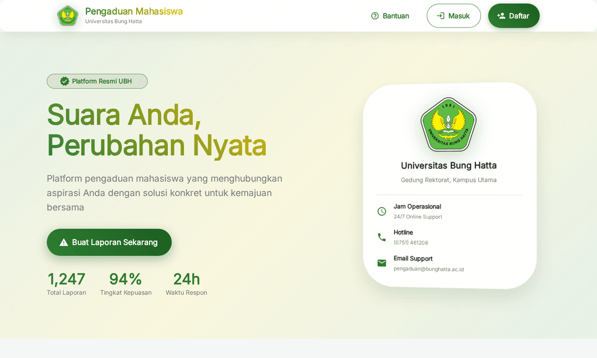

### 2.1 Mendaftar akun

1. Di beranda, klik **Daftar** di kanan atas.
2. **Langkah 1 — Identitas Mahasiswa**: isi NIM (minimal 8 digit angka), nama lengkap sesuai KTM, dan email kampus. Klik **Lanjutkan**.
3. **Langkah 2 — Keamanan Akun**: buat password minimal 8 karakter yang mengandung huruf besar, huruf kecil, dan angka, lalu ketik ulang di kolom konfirmasi.
4. **Langkah 3 — Verifikasi**: unggah foto KTM (JPG, PNG, atau WebP, maksimal 5 MB). Pastikan nama, NIM, dan foto terbaca jelas.
5. Klik **Daftar Sekarang**. Anda akan menerima email setelah admin memverifikasi akun.

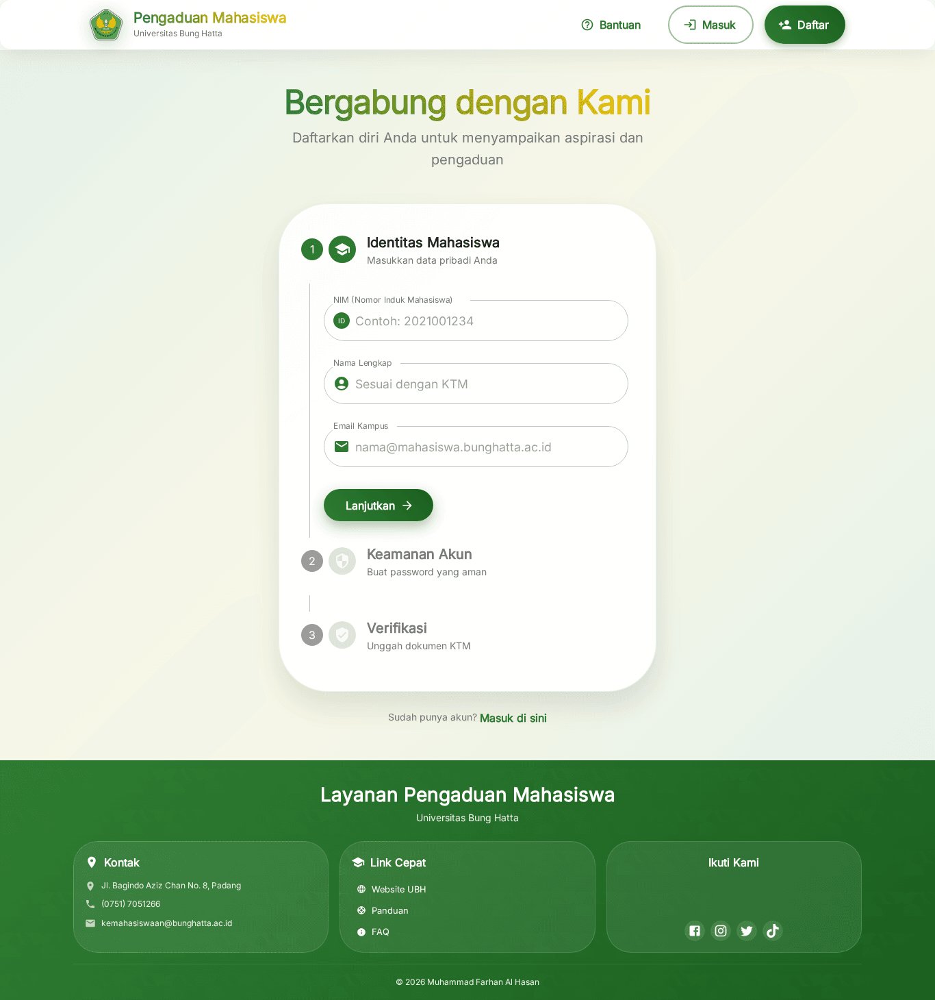

Bila pendaftaran ditolak (misalnya foto KTM buram), Anda menerima email berisi alasannya dan dapat mendaftar ulang.

### 2.2 Masuk

1. Klik **Masuk**, isi email kampus dan password, lalu klik **Masuk ke Akun**.
2. Mahasiswa diarahkan ke **Dasbor**; admin dan superadmin ke **Portal Admin**.
3. Bila muncul pesan bahwa akun belum terverifikasi, tunggu verifikasi admin atau hubungi Bagian Kemahasiswaan.

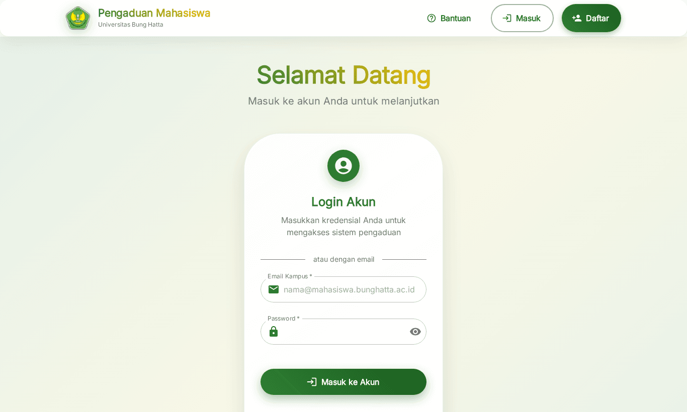

### 2.3 Lupa password

1. Di halaman masuk, klik **Lupa Password**.
2. Masukkan email terdaftar, lalu klik **Kirim Link Reset**.
3. Buka email dari sistem, klik tautannya, lalu buat password baru. Tautan berlaku 1 jam dan hanya bisa dipakai sekali.
4. Setelah password diganti, Anda keluar dari semua perangkat dan perlu masuk lagi.

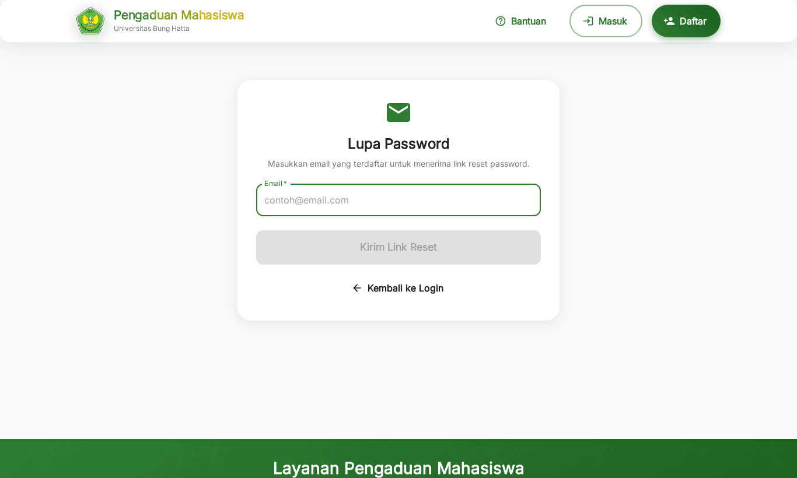

Demi keamanan, sistem selalu menampilkan pesan yang sama walaupun email tidak terdaftar. Bila email tidak datang dalam 10 menit, periksa folder spam.

## 3. Mahasiswa: Laporan dan Percakapan

Setelah masuk, Dasbor menampilkan ringkasan dan daftar semua laporan Anda. Dari sini Anda membuat laporan, melihat perkembangannya, dan membuka percakapan dengan petugas.

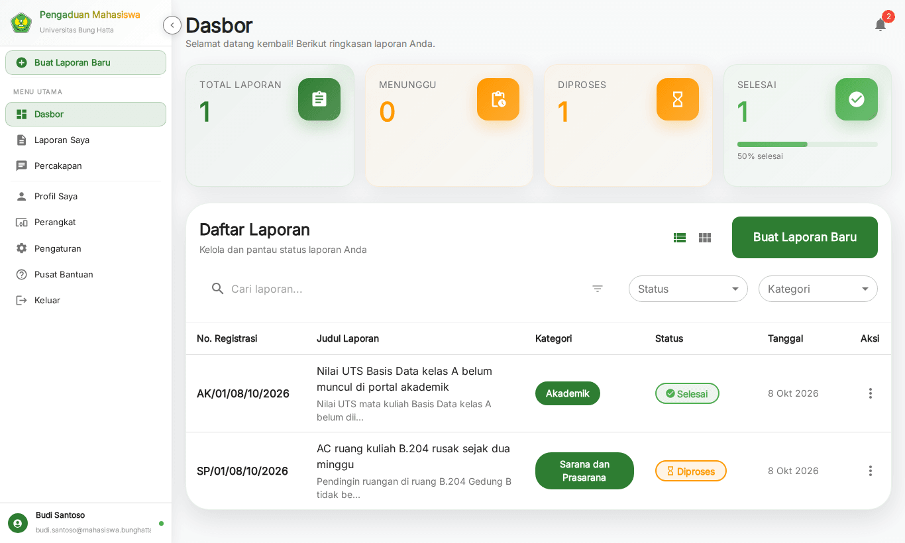

### 3.1 Dasbor

- **Kartu ringkasan** menampilkan jumlah laporan total, yang menunggu, yang diproses, dan yang selesai.
- **Daftar Laporan** bisa dicari berdasarkan judul atau isi, serta disaring per status dan kategori.
- Ikon lonceng di kanan atas menampilkan pembaruan laporan yang belum Anda lihat.
- Menu kiri: **Laporan Saya**, **Percakapan**, **Profil Saya**, **Perangkat**, **Pengaturan**, **Pusat Bantuan**, dan **Keluar**.

### 3.2 Membuat laporan

1. Klik **Buat Laporan Baru** (di menu kiri atau di atas daftar laporan).
2. **Informasi Laporan**: isi judul yang singkat dan jelas, lalu pilih kategori. Klik **Lanjutkan**.
3. **Detail Laporan**: jelaskan masalahnya, termasuk kapan dan di mana terjadi serta dampaknya (minimal 10 karakter). Toolbar di atas kolom dapat dipakai untuk huruf tebal, miring, atau daftar.
4. **Lampiran** (opsional): unggah foto atau dokumen pendukung, maksimal 10 berkas dengan ukuran masing-masing 5 MB. Format yang diterima: JPG, PNG, WebP, PDF, DOC, DOCX.
5. Klik **Kirim Laporan**. Laporan mendapat nomor registrasi, misalnya `SP/01/08/10/2026`. Simpan nomor ini untuk tindak lanjut.

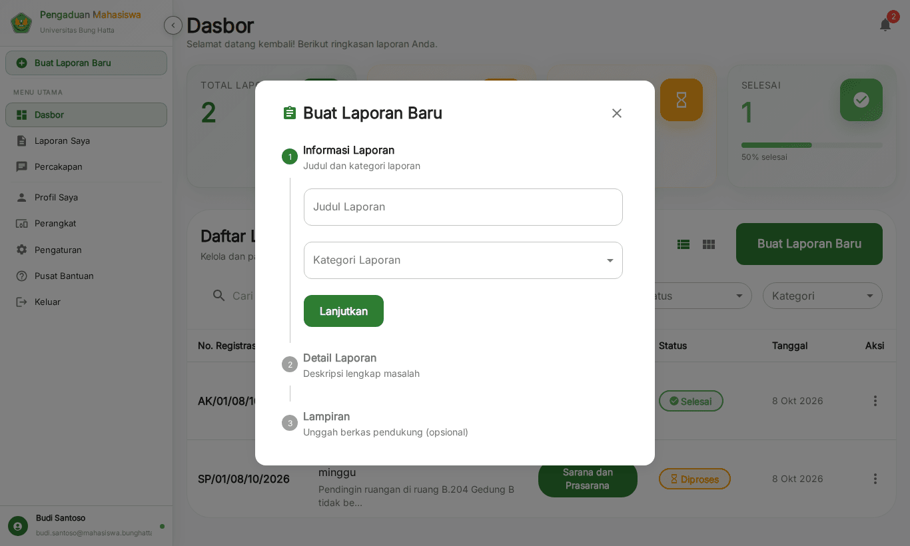

Satu akun dapat mengirim paling banyak 5 laporan per jam.

### 3.3 Laporan anonim

Pilihan **Laporkan secara anonim** muncul di langkah Informasi Laporan, tepat di bawah pilihan kategori, hanya untuk kategori yang mengizinkannya. Secara bawaan, kategori tersebut adalah Kekerasan Seksual, Diskriminasi, Penyalahgunaan Wewenang Dosen/Staff, Korupsi, dan Pelanggaran Hak Asasi Manusia.

Pada laporan anonim, nama, NIM, dan email Anda disembunyikan dari semua petugas, termasuk superadmin. Anda tetap bisa memantau laporan dan membalas pertanyaan petugas lewat percakapan; nama Anda tampil sebagai "Anonim". Hindari menulis identitas Anda di isi laporan atau lampiran bila ingin tetap anonim.

### 3.4 Melihat detail dan status

1. Di daftar laporan, klik ikon titik tiga pada baris laporan, lalu pilih **Lihat Detail**.
2. Jendela detail menampilkan status, kategori, tanggal, deskripsi, dan lampiran. Klik **Buka** pada lampiran untuk melihatnya.
3. Bila laporan ditolak atau dibatalkan, alasannya tampil di jendela ini.
4. Klik **Buka Percakapan** untuk berdiskusi dengan petugas.

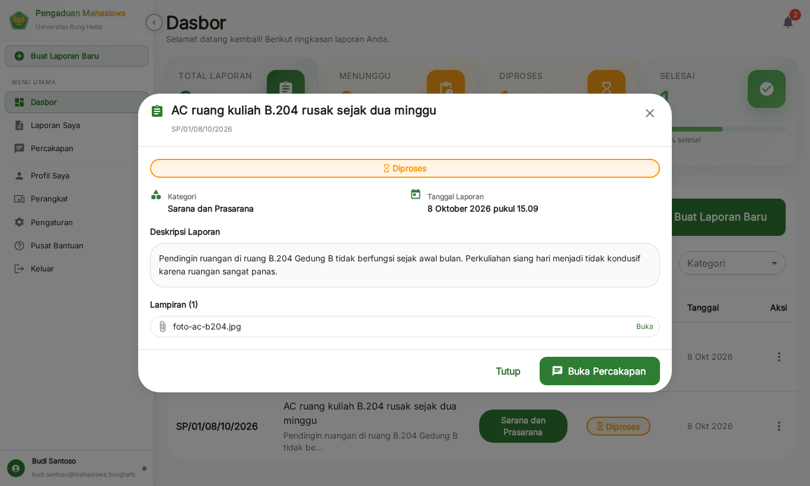

Anda juga menerima email setiap kali status laporan berubah.

### 3.5 Mengedit atau membatalkan laporan

- **Edit**: selama status masih **Menunggu**, tombol **Edit Laporan** tersedia di jendela detail. Anda bisa mengubah judul, deskripsi, dan kategori, lalu klik **Simpan Perubahan**. Setelah laporan mulai ditinjau, laporan tidak bisa diedit lagi.
- **Batal**: aplikasi versi ini belum menyediakan tombol pembatalan untuk mahasiswa. Bila ingin membatalkan laporan, kirim pesan di percakapan laporan tersebut; petugas akan mengubah statusnya menjadi Dibatalkan beserta alasannya.

### 3.6 Percakapan dengan petugas

1. Buka menu **Percakapan**, atau klik **Buka Percakapan** di detail laporan.
2. Pilih laporan di daftar kiri. Angka merah menandakan pesan yang belum dibaca.
3. Ketik pesan di kolom bawah, lalu tekan Enter atau ikon kirim (Shift+Enter untuk baris baru). Klik ikon klip untuk melampirkan berkas.
4. Untuk membalas pesan tertentu atau menghapus pesan Anda sendiri, klik ikon titik tiga di samping pesan.

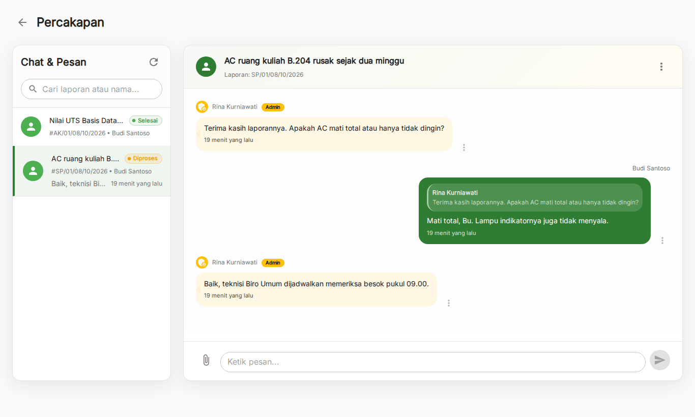

Pesan baru dan tanda "sedang mengetik" tampil seketika tanpa perlu memuat ulang halaman. Bila Anda sedang tidak membuka aplikasi, sistem mengirim pemberitahuan lewat email.

### 3.7 Profil, pengaturan, dan perangkat

- **Profil Saya**: lihat data akun dan klik **Edit Profil** untuk mengubah nama, NIM, atau email. Mengganti email meminta password saat ini, dan setelahnya Anda harus masuk lagi di semua perangkat.
- **Pengaturan**: atur email notifikasi, bahasa, dan tema tampilan, lalu klik **Simpan Pengaturan**. Pengaturan tersimpan di akun, jadi berlaku di semua perangkat. Untuk mengganti password, buka bagian **Privasi & Keamanan** lalu klik **Ubah Password**; setelahnya Anda perlu masuk lagi.
- **Perangkat Aktif**: daftar perangkat yang sedang masuk ke akun Anda. Keluarkan perangkat yang tidak dikenal, atau klik **Logout Perangkat Lain** bila Anda curiga akun dipakai orang lain. Satu akun bisa masuk di paling banyak 3 perangkat; saat masuk dari perangkat keempat, perangkat yang paling lama tidak dipakai dikeluarkan otomatis.

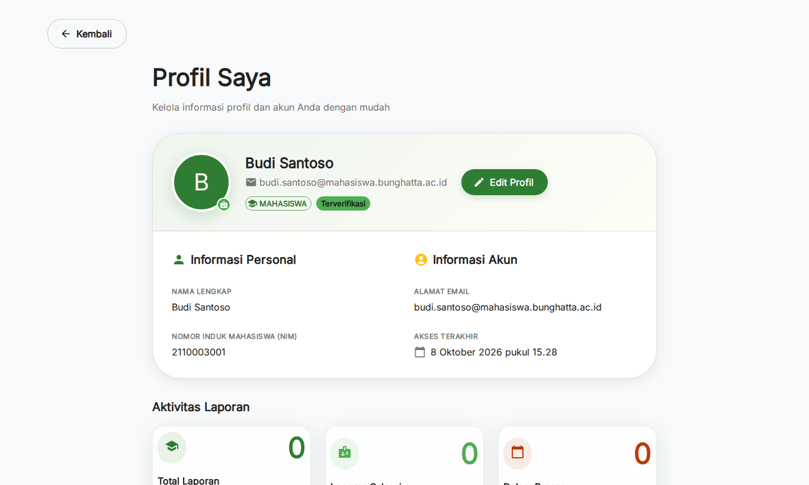

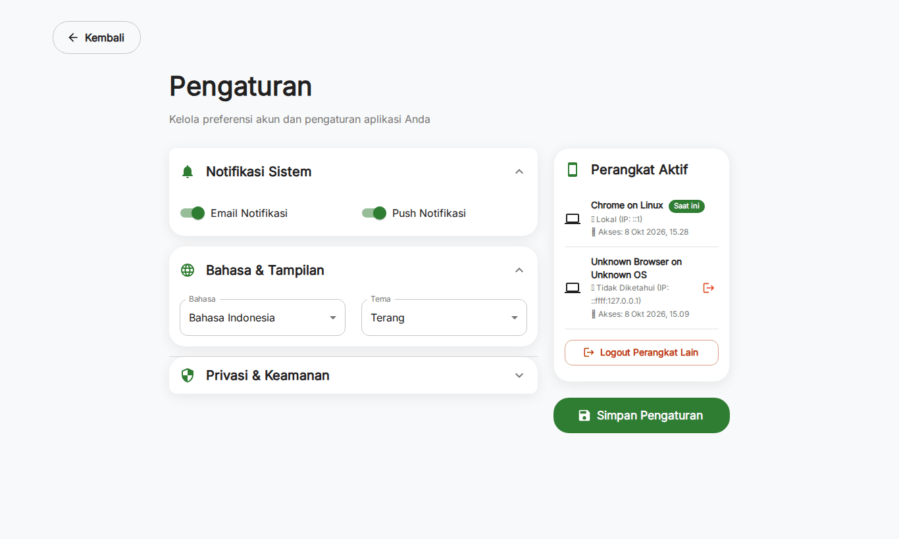

## 4. Admin: Menangani Laporan

Admin hanya melihat dan menangani laporan dari kategori yang ditugaskan superadmin kepadanya. Bila daftar laporan kosong padahal seharusnya ada, minta superadmin memeriksa penugasan kategori Anda.

### 4.1 Dasbor

Setelah masuk, admin melihat **Portal Admin**. Kartu di Dasbor menghitung laporan per status, dan grafik **Distribusi Status** menampilkan komposisinya. Semua angka hanya mencakup kategori yang ditugaskan kepada Anda. Klik ikon segarkan di kanan atas untuk memperbarui data.

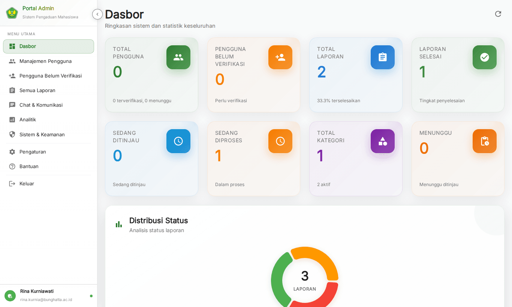

### 4.2 Daftar laporan

1. Buka menu **Semua Laporan**.
2. Gunakan kotak pencarian, filter **Status**, atau tombol **Ditugaskan kepada saya** untuk mempersempit daftar.
3. Klik ikon titik tiga pada baris, lalu pilih **Lihat Detail** untuk membuka laporan.

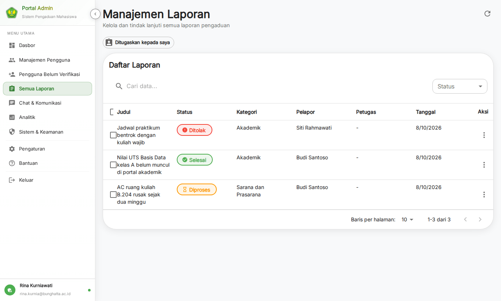

### 4.3 Meninjau dan memperbarui laporan

Jendela detail menampilkan pelapor, kategori, tanggal, deskripsi, lampiran, serta dua panel kerja.

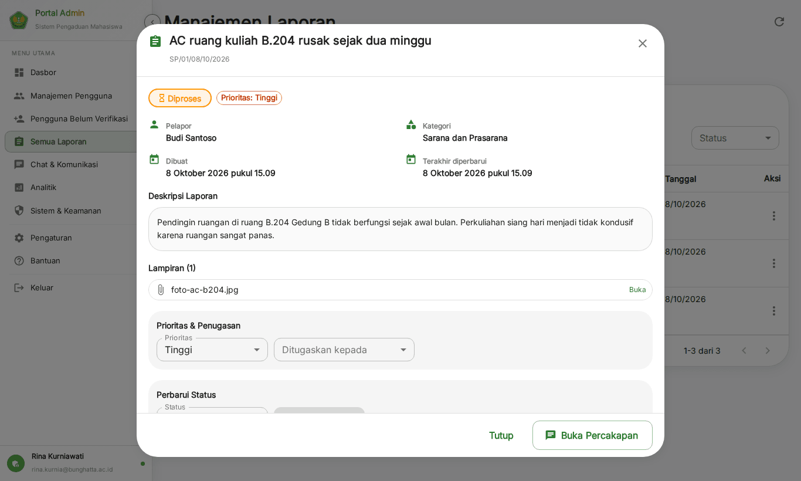

**Prioritas & Penugasan**

- **Prioritas**: Rendah, Sedang, Tinggi, atau Mendesak. Prioritas awal mengikuti pengaturan kategori.
- **Ditugaskan kepada**: pilih admin yang bertanggung jawab; perubahan langsung tersimpan. Catatan versi ini: nama petugas yang sudah ditugaskan belum ditampilkan kembali di kolom ini maupun di kolom Petugas pada daftar. Untuk melihat laporan yang ditugaskan kepada Anda, gunakan tombol **Ditugaskan kepada saya** di daftar laporan.

**Perbarui Status**

1. Pilih status baru. Hanya perpindahan berikut yang diizinkan:

   | Dari | Ke |
   | --- | --- |
   | Menunggu | Ditinjau, Ditolak, Dibatalkan |
   | Ditinjau | Diproses, Selesai, Ditolak, Dibatalkan |
   | Diproses | Selesai, Ditolak, Dibatalkan |
   | Selesai / Ditolak | Ditinjau (dibuka kembali) |
   | Dibatalkan | Menunggu (diajukan ulang) |

2. Isi **Alasan**. Untuk Ditolak dan Dibatalkan alasan wajib diisi dan akan dibaca pelapor, jadi tulis dengan jelas dan sopan.
3. Klik **Simpan Status**. Pelapor menerima email pemberitahuan.

Pada laporan anonim, kolom pelapor bertuliskan **Identitas disembunyikan**. Gunakan percakapan bila memerlukan keterangan tambahan. Setiap kali admin membuka laporan anonim, sistem mencatatnya di audit log.

### 4.4 Operasi massal

Centang beberapa laporan di daftar, lalu gunakan bilah aksi yang muncul: **Ubah Status Laporan**, **Hapus**, atau **Pulihkan** (maksimal 100 laporan sekaligus). Laporan yang tidak memenuhi syarat, misalnya karena perpindahan statusnya tidak diizinkan, dilewati, dan sistem menampilkan jumlah yang berhasil diproses.

### 4.5 Verifikasi mahasiswa

1. Buka **Pengguna Belum Verifikasi**.
2. Klik **Lihat KTM** dan cocokkan nama serta NIM dengan data pendaftar.
3. Klik ikon titik tiga, lalu pilih **Verifikasi** bila cocok, atau **Tolak** dengan menuliskan alasan (pendaftar menerima email berisi alasan tersebut).
4. Untuk memverifikasi banyak akun sekaligus, centang beberapa baris lalu pilih **Verifikasi** di bilah aksi.

### 4.6 Percakapan dengan pelapor

Menu **Chat & Komunikasi** menampilkan semua percakapan laporan dalam cakupan Anda, lengkap dengan jumlah pesan belum dibaca. Pilih laporan untuk membalas. Cara mengirim, melampirkan berkas, dan membalas pesan sama dengan bagian 3.6.

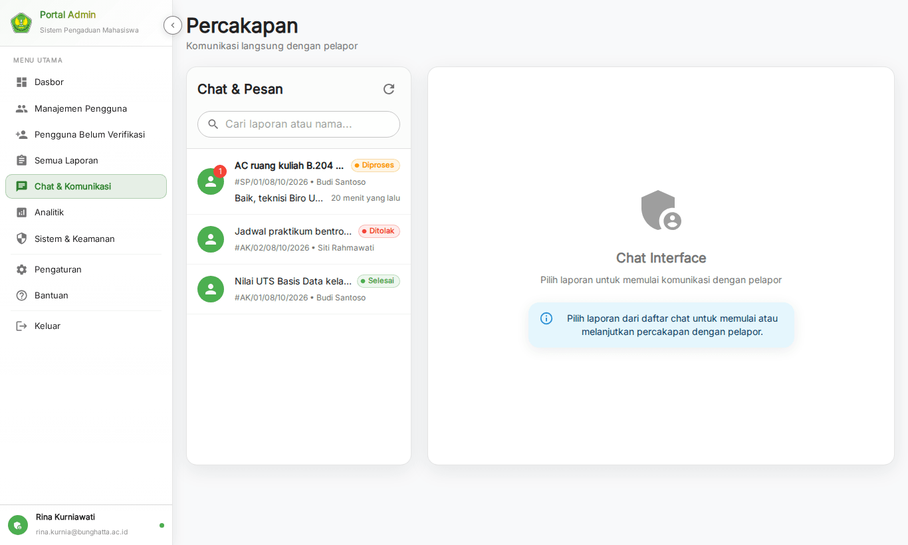

Tanggapi pesan sesegera mungkin. Pelapor yang sedang tidak membuka aplikasi akan mendapat email setiap ada pesan baru dari Anda.

### 4.7 Analitik dan ekspor

- **Analitik** menampilkan total laporan, tingkat penyelesaian, laporan yang menunggu tinjauan, kategori terpopuler, dan tren pengaduan. Pilih rentang waktu **24H**, **7D**, **30D**, atau **Semua** di kanan atas.
- **Ekspor data pengguna**: di **Manajemen Pengguna**, klik **Ekspor** untuk mengunduh daftar pengguna yang sedang tampil.
- **Ekspor laporan ke CSV** sudah tersedia di server (`GET /v1/api/admin/export/reports`) tetapi belum ada tombolnya di aplikasi. Untuk sementara, minta tim TI menjalankannya.

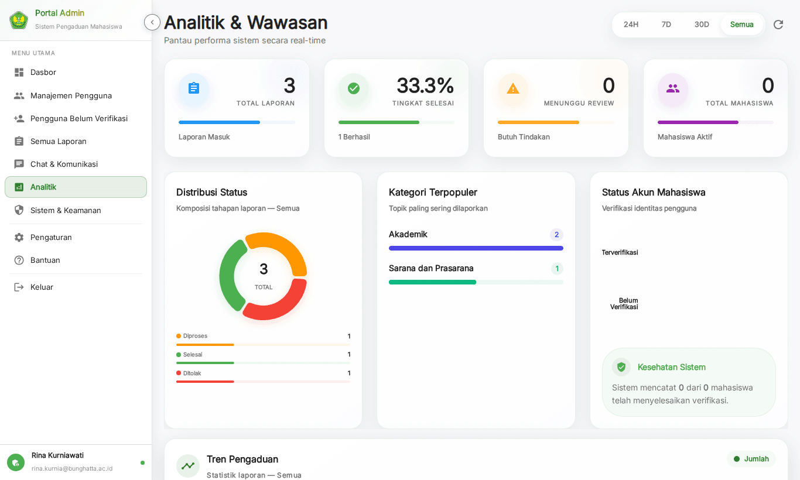

## 5. Superadmin: Mengelola Sistem

Superadmin memiliki semua kemampuan admin untuk seluruh kategori, ditambah menu **Kategori Laporan**, **Kelola Admin**, dan **Riwayat Audit**. Sebaiknya ada minimal dua superadmin aktif agar pengelolaan tidak bergantung pada satu orang.

### 5.1 Verifikasi dan manajemen pengguna

- **Pengguna Belum Verifikasi**: langkahnya sama dengan bagian 4.5.
- **Manajemen Pengguna**: cari pengguna berdasarkan nama, NIM, atau email, lalu saring menurut status, verifikasi, atau peran. Menu titik tiga pada tiap baris berisi **Lihat Detail**, **Verifikasi**, **Hapus**, dan **Pulihkan**. Pengguna yang dihapus masih bisa dipulihkan sampai dibersihkan permanen (bagian 5.5).

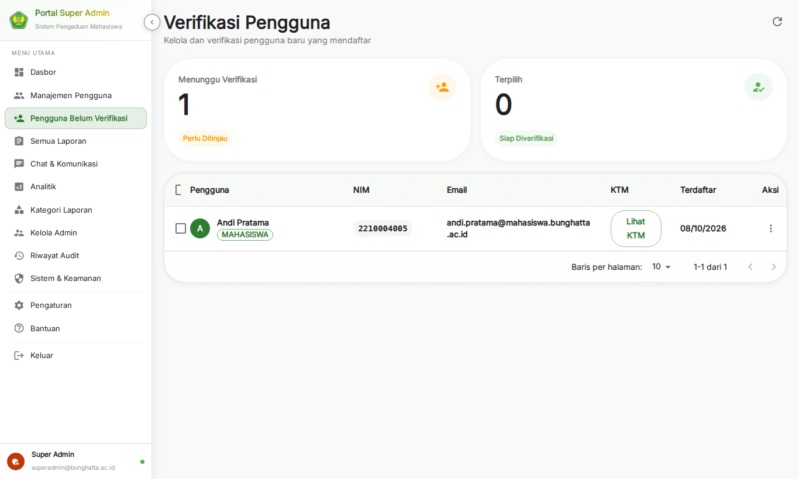

### 5.2 Mengangkat admin dan memberi kategori

1. Pastikan calon admin sudah punya akun terverifikasi (mendaftar seperti mahasiswa).
2. Buka **Manajemen Pengguna**, klik titik tiga pada akun tersebut, pilih **Lihat Detail**, lalu klik **Jadikan Admin**.
3. Buka **Kelola Admin**. Pada kartu admin baru, klik titik tiga lalu pilih **Berikan kategori**. Pilih kategori, lalu klik **Berikan**. Ulangi untuk setiap kategori yang menjadi tanggung jawabnya.
4. Untuk mencabut kategori, klik tanda silang pada label kategori di kartu admin, lalu konfirmasi. Laporan kategori itu yang sedang ditugaskan kepada admin tersebut akan dilepas.

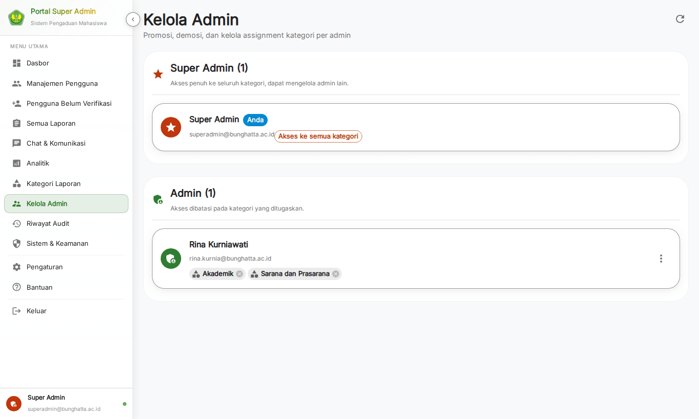

Menu titik tiga di kartu admin juga berisi:

- **Promosikan menjadi Super Admin**.
- **Ubah menjadi mahasiswa**: menurunkan admin. Semua penugasan kategorinya dihapus dan ia langsung dikeluarkan dari sistem.
- **Ubah menjadi admin** (pada kartu superadmin lain): menurunkan superadmin menjadi admin. Superadmin terakhir tidak bisa diturunkan atau dihapus.

### 5.3 Kategori laporan

1. Buka **Kategori Laporan** untuk melihat semua kategori beserta prioritas bawaan dan izin anonim.
2. Klik **Tambah Kategori**, isi nama, pilih **Prioritas Bawaan** (Rendah, Sedang, Tinggi, Mendesak), dan tentukan apakah laporan anonim diizinkan.
3. Untuk mengubah atau menghapus kategori, gunakan menu titik tiga pada barisnya. Kategori yang dihapus bisa dipulihkan lewat filter **Status Kategori: Dihapus**.

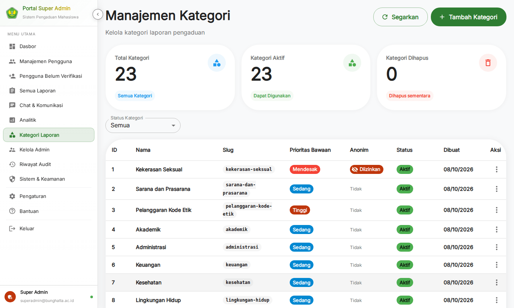

Kategori baru tidak otomatis ditangani siapa pun. Setelah membuatnya, segera berikan kategori itu ke admin yang tepat (bagian 5.2). Bila belum ada admin yang ditugaskan, laporan di kategori tersebut hanya terlihat oleh superadmin.

### 5.4 Riwayat audit

**Riwayat Audit** mencatat siapa melakukan apa dan kapan: perubahan status, verifikasi, promosi dan demosi admin, penugasan kategori, penghapusan, dan setiap kali laporan anonim dibuka. Saring berdasarkan tipe entitas, aksi, atau rentang tanggal; klik titik tiga untuk melihat detail perubahan.

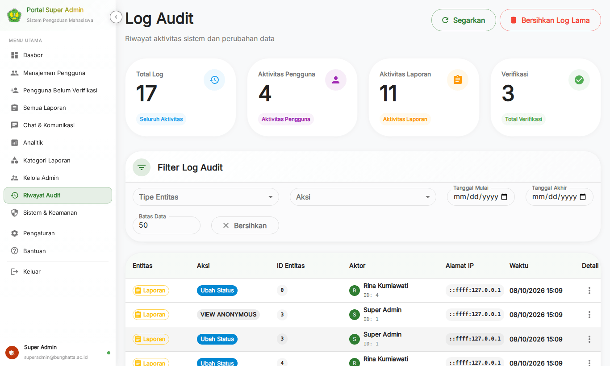

Gunakan riwayat ini untuk pemeriksaan berkala, misalnya bulanan, atau ketika ada keberatan atas penanganan sebuah laporan. Tombol **Bersihkan Log Lama** menghapus log secara permanen, jadi gunakan hanya sesuai kebijakan retensi kampus.

### 5.5 Sistem dan keamanan

Halaman **Sistem & Keamanan** berisi ringkasan fitur keamanan dan alat **Pembersihan Basis Data**:

- **Bersihkan Pengguna Terhapus**: menghapus permanen akun yang sudah dihapus lebih dari jumlah hari yang ditentukan.
- **Bersihkan Log Audit**: menghapus log audit yang lebih lama dari jumlah hari yang ditentukan.

Kedua tindakan tidak dapat dibatalkan. Pastikan tim TI sudah membuat cadangan database sebelum menjalankannya.

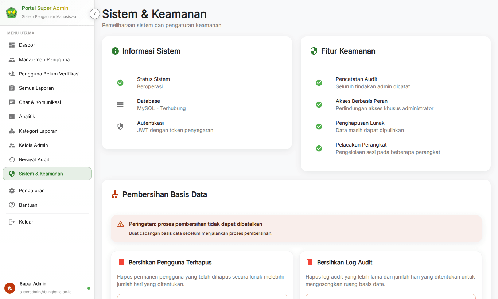

Catatan: kartu Informasi Sistem menyebut database "MySQL". Ini teks statis yang keliru, karena database yang dipakai adalah PostgreSQL.

## 6. Tanya Jawab dan Pemecahan Masalah

Sebagian besar kendala bisa diselesaikan sendiri dengan langkah di tabel ini. Bila masalah berlanjut, hubungi kontak di bawah tabel.

| Masalah | Penyebab umum | Yang perlu dilakukan |
| --- | --- | --- |
| Tidak bisa masuk, muncul pesan akun belum terverifikasi | Admin belum memeriksa KTM | Tunggu email verifikasi. Bila lebih dari 3 hari kerja, hubungi Bagian Kemahasiswaan. |
| Muncul pesan "Terlalu banyak percobaan" | Terlalu banyak percobaan masuk atau permintaan dalam waktu singkat | Tunggu 15 menit lalu coba lagi. Bila sering terjadi di jaringan kampus, laporkan ke tim TI. |
| Tiba-tiba keluar dari akun | Password diganti, semua perangkat dikeluarkan, akun dipakai masuk di lebih dari 3 perangkat, atau sesi berakhir | Masuk lagi. Bila tidak merasa melakukannya, segera ganti password. |
| Email verifikasi atau reset password tidak datang | Email masuk ke folder spam, atau alamat salah | Periksa folder spam, lalu minta tautan baru. |
| Pilihan laporan anonim tidak muncul | Kategori yang dipilih tidak mengizinkan laporan anonim | Pilih kategori yang sesuai, atau hubungi superadmin bila kategori seharusnya mengizinkan anonim. |
| Berkas gagal diunggah | Ukuran lebih dari 5 MB atau format tidak didukung | Gunakan JPG, PNG, WebP, PDF, DOC, atau DOCX di bawah 5 MB. |
| Tombol Edit Laporan tidak ada | Laporan sudah ditinjau (status bukan Menunggu) | Sampaikan koreksi lewat percakapan laporan. |
| Admin tidak melihat laporan apa pun | Admin belum diberi kategori | Superadmin memberikan kategori di Kelola Admin. |
| Pesan baru tidak langsung muncul | Koneksi terputus | Klik ikon segarkan di daftar percakapan atau muat ulang halaman. |

### Kontak bantuan

- Pertanyaan tentang laporan atau verifikasi akun: Bagian Kemahasiswaan Universitas Bung Hatta (kontak diisi kampus).
- Kendala teknis aplikasi: Unit TI (kontak diisi kampus).

### Menjaga keamanan akun

- Jangan bagikan password, termasuk kepada petugas. Petugas tidak pernah meminta password Anda.
- Selalu klik **Keluar** di komputer bersama.
- Periksa **Perangkat Aktif** secara berkala dan keluarkan perangkat yang tidak dikenal.
